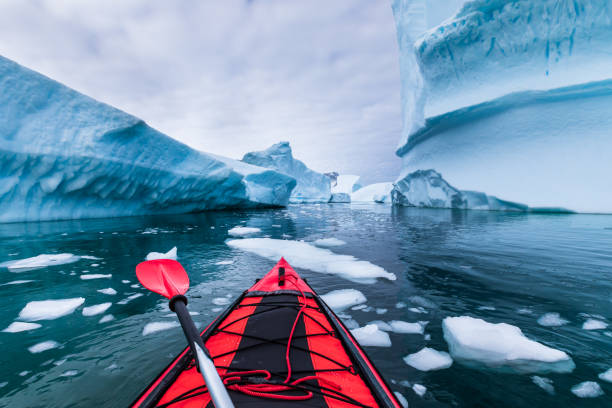
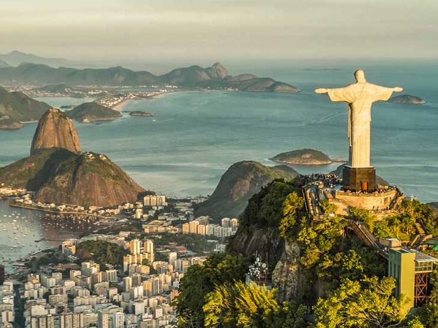
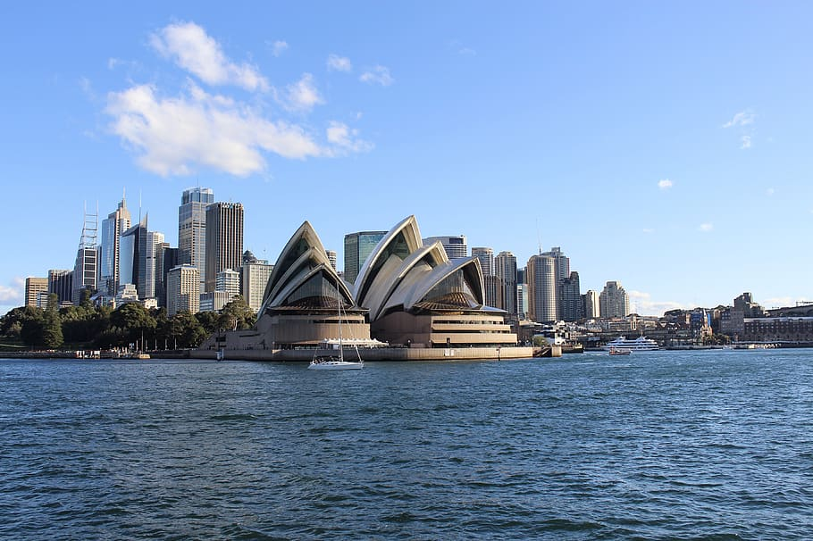

# Travel 
A huge life goal of mine is to travel to the seven continents. Seeing the world and getting to know different cultures and people have always interested me. I love traveling and hope to do it more as I continue to grow as a person. Below are just some of the many places I would love to travel to. 

 
There are many places I would like to visit but here are juse some of my top choices around the world.

1. Asia 
    - Tokyo, Japan 
     

 
    
2. North America 
    - Canada 
     

 

3. Antartica 
 

    
 

4. South America 
    - Brazil 
     
    
 

5. Africa
    - Lagos, Nigeria 
     
    

6. Europe 
    - Paris 
     
    

7. Australia/ Oceania 
    